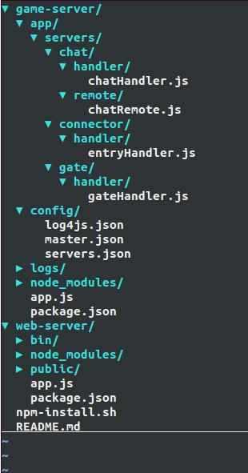

在这一部分，我们来实现一个简易的分布式聊天应用，为了简单化，我们将直接从github上获取对应的源码，当然你也可以首先`pomelo init`,获得一个初始的项目目录，然后参照github上的源码，建立相应的目录，在默认的位置填充相应的源码。


源码结构
===========

源码在github上面，通过如下命令，获得：

    $ git clone https://github.com/NetEase/chatofpomelo-websocket.git
    $ git checkout tutorial-starter

这个是很简单的应用，其代码结构如下图：



#### game-server

game-server目录放的是所有游戏服务器的逻辑，以文件app.js作为入口，运行游戏的所有逻辑和功能。从图上可以看出其servers里面有三个目录，分别是gate，connector，chat。在pomelo中，使用路径来区分服务器类型，因此三个目录代表了三种不同类型的服务器，每一个目录下面可以定义handler,remote,定义了handler和remote就决定了这个服务器的行为。

* 对于gate服务器，其逻辑实现代码在其gateHandler.js中，它接受客户端查询connector的请求，返回给客户端一个可以连接的connector的(ip,port);

* connector服务器，其逻辑代码在entryHandler.js中，它主要完成接受客户端的请求，维护与客户端的连接，路由客户端的请求到chat服务器;

* chat服务器，其既有handler代码，也有remote代码， handler中处理用户的send请求，而remote是当有用户加入或者退出的时候，由connector来发起远程调用时调用的。在remote里由于涉及到用户的加入和退出，所以会有对channel的操作。

game-server 的子目录config下面是游戏服务器所用到的配置文件存放的地方，配置信息使用JSON格式，包含有日志，master服务器和其他服务器的配置信息。除了这个pomelo所需的配置信息外，一般情况下，也将游戏逻辑所需要的配置信息放到这个目录下，例如数据库的配置信息，地图信息等。

logs子目录下存放游戏服务器产生的所有的日志信息。 

#### web-server

由于我们这个聊天应用的客户端是web，所以需要一个web服务器。在这个目录下，主要是客户端的js，css和静态资源等等。在本例子中，里面有用户登录，聊天的逻辑的js文件等等。我们在这个例子教程中，更多地关注的是服务器端的逻辑以及功能，对于客户端，我们几乎不需要怎么修改其代码，直接使用默认就好。

安装及运行
===============

首先，确保你已经成功安装了pomelo。执行命令安装依赖:

    $ sh npm-install.sh

启动游戏服务器:

    $ cd game-server
    $ pomelo start

启动web服务器:

    $ cd web-server
    $ node app.js

如果启动过程中没有问题的话，下面我们就可以使用我们的聊天服务了，打开浏览器，输入`http://127.0.0.1:3001/index.html`, 输入一个用户名和一个房间名，就可以加入到聊天中了。可以多开几个客户端实例，测试chat是否能正常地运行，可以在一个房间里广播，也可以单个给某一个人发消息，效果图如下： 


chat分析
================

我们要搭建的pomelo聊天室具有如下的运行架构：

 

 在这个架构里，前端服务器也就是connector专门负责承载连接， 后端的聊天服务器则是处理具体逻辑的地方。
 这样扩展的运行架构具有如下优势：
 * 负载分离：这种架构将承载连接的逻辑与后端的业务处理逻辑完全分离，这样做是非常必要的， 尤其是广播密集型应用（例如游戏和聊天）。密集的广播与网络通讯会占掉大量的资源，经过分离后业务逻辑的处理能力就不再受广播的影响。

 * 切换简便：因为有了前、后端两层的架构，用户可以任意切换频道或房间都不需要重连前端的websocket。

 * 扩展性好：用户数的扩展可以通过增加connector进程的数量来支撑。频道的扩展可以通过哈希分区等算法负载均衡到多台聊天服务器上。理论上这个架构可以实现频道和用户的无限扩展。

#### 客户端
聊天室的逻辑包括以下几个部分：
*   用户进入聊天室：这部分逻辑负责把用户信息注册到session，并让用户加入聊天室的channel。
*   用户发起聊天： 这部分包括了用户从客户端发起请求，服务端接收请求等功能。
*   广播用户的聊天： 所有在同一个聊天室的客户端收到请求并显示聊天内容。
*   用户退出： 这部分需要做一些清理工作，包括session和channel的清理。

客户端首先要给gate服务器查询一个connector服务器，gate给其回复一个connector的地址及端口号，这里没有列出完整的代码，具体的代码在路径web-server/public/js/client.js中,详细代码略去，见client.js:

```javascript
function queryEntry(uid, callback) {
  var route = 'gate.gateHandler.queryEntry';
  // ...
}

$("#login").click(function() {
  username = $("#loginUser").attr("value");
  rid = $('#channelList').val();

  // ...

 //query entry of connection
  queryEntry(username, function(host, port) {
    pomelo.init({
      host: host,
      port: port,
      log: true
    }, function() {
              // ...
    });
  });
});

```

客户端在查询到connector后，需要发请求给connector服务器， 第一次请求要给connector进程，因为首次进入时需要绑定对应的uid信息，这里略去详细代码:

```javascript
pomelo.request('connector.entryHandler.enter', {username: username, rid: rid}, function(){
  // ...
}); 
```
当用户发起聊天的时候，会请求服务chat.chatHandler.send，大致代码如下:

```javascript
pomelo.request('chat.chatHandler.send', {content:msg, from: username, target: msg.target}, function(data) {
  // ...
});
```
当有用户加入、离开以及发起聊天时，同房间的人将会收到服务端推送来的相应消息,这些在客户端是以回调的方式进行添加的，大致代码如下：

```javascript

pomelo.on('onAdd', function(data) {
  // ...
});

pomelo.on('onLeave', function(data) {
  // ...
});

pomelo.on('onChat', function(data) {
  // ...
});

```

客户端的详细代码都在目录web-server/public/js/client.js文件中，这里，客户端的js是使用[component](https://github.com/component/component)进行管理的,详细请参阅component的参考文档。

### 服务端

我们知道，在pomelo中，只要定义了一个服务器的handler和remote，那么就定义了这个服务器的行为，就决定了这个服务器的类型。在本例子中，有三种服务器，gate，connector，chat,它们完成的具体逻辑如下:

* gate完成客户端对connector的查询，在其handler里有其实现的代码，由于在这里，本例中仅仅配置了一台connector服务器，因此直接返回其信息给客户端即可，然后客户端就可以连接到connector了。

```javascript
handler.queryEntry = function(msg, session, next) {
	var uid = msg.uid;
	// ...
};
```

* connector接受用户的连接，完成用户的注册及绑定，维护客户端session信息，处理客户端的断开连接，其逻辑代码在connector/handler/entryHandler.js中。大致如下：

```javascript
handler.enter = function(msg, session, next) {
	var self = this;
	var rid = msg.rid;
	var uid = msg.username + '*' + rid
	var sessionService = self.app.get('sessionService');
  // .....
};
```

* chat服务器是执行聊天逻辑的地方，它维护channel信息，一个房间就是一个channel，一个channel里有多个用户，当有用户发起聊天的时候，就会将其内容广播到整个channel。chat服务器还会接受connector的远程调用，完成channel维护中的用户的加入以及离开，因此chat服务器不仅定义了handler，还定义了remote。当有客户端连接到connector上后，connector会向chat发起远程过程调用，chat会将登录的用户，加到对应的channel中，其大致代码为：

```javascript
// chatHandler.js
handler.send = function(msg, session, next) {
	var rid = session.get('rid');
	var username = session.uid.split('*')[0];
	// .....
};

// chatRemote.js
ChatRemote.prototype.add = function(uid, sid, name, flag, cb) {
	var channel = this.channelService.getChannel(name, flag);
};

ChatRemote.prototype.kick = function(uid, sid, name) {
	var channel = this.channelService.getChannel(name, false);
  // ...
};
```
* **注意** 在实现具体的Handler的时候，最后需要调用next，其中next的签名为 next(err, resp).如果没有出现错误，那么err为空即可；如果不是request请求，而是notify的话，则一样需要调用next，此时resp参数是不需要的，一般情况下，如果没有错误的话，就直接使用``next(null)``即可。

服务器配置信息在config目录下，现在我们只关注servers.json, master.json。master.json配置是master服务器的配置信息，包括地址端口号，servers.json配置具体的应用服务器信息。在配置文件中，分为development和production两种环境，表示开发环境和产品环境，我们在`pomelo start`后面可以通过-e可以指定使用哪个环境，更多帮助参见`pomelo start --help`。

小结
========

在这部分，我们下载了一个简单的聊天应用，并安装运行起来，并对其源码进行了分析。在本例子中，为了简单起见，我们对每一种类型仅仅配置一台服务器，其中对于前端服务器来说需要指定frontend为true。[下一步](扩充服务器 "多台服务器")，我们将对每一种服务器类型配置多台服务器，以此来展示pomelo强大的可伸缩性。

