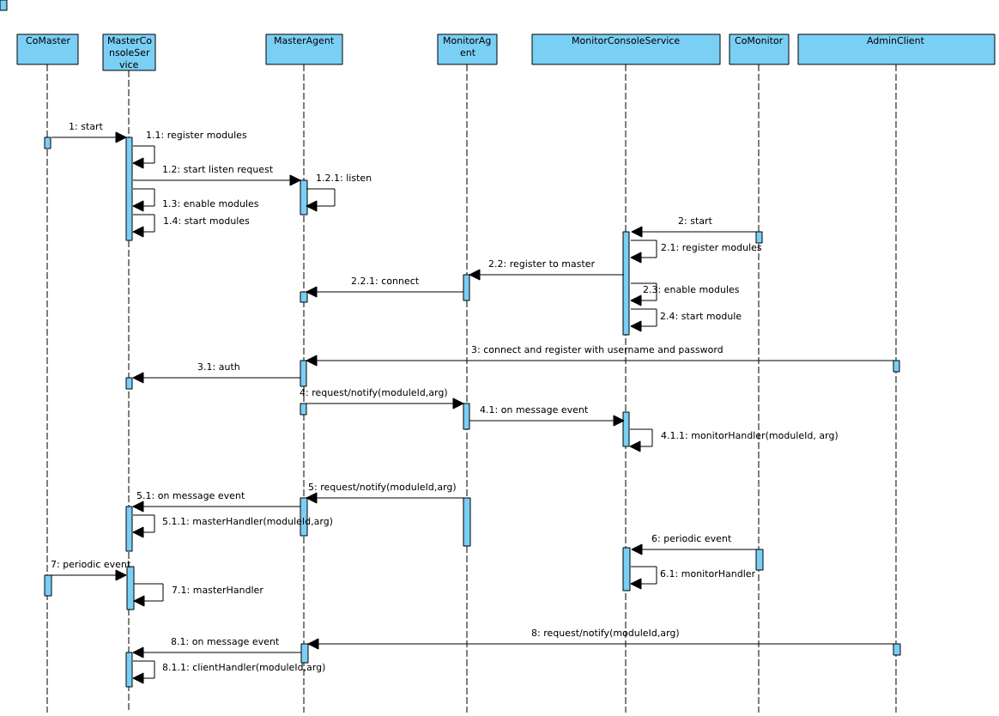

在前面的介绍中，我们知道pomelo支持动态地增加以及删除某一个服务器，于是我们会问当增加一个应用服务器的时候，已经启动的应用服务器是怎么知道新增加了一个服务器的；当停止某个服务器时，其他服务器又是怎样获知这些消息，并使得以后的rpc或者消息不路由到已经停止的服务器的。还有，如果查看整个服务器群的信息，或者整个服务器群的运行状态。诸如此类的问题，pomelo提供了一个管理框架，通过对这个框架进行扩展，用户将可以自己定制一些需要监控的信息，下面将对此进行介绍。

pomelo管理框架
===============

* pomelo的管理框架中，将对应的主体分为三种角色，分别为master，monitor，client。其中master可以认为对应于master服务器的Master组件，monitor可以认为是所有服务器都加载的Monitor组件。而client，可以认为是第三方的管理工具，pomelo提供的命令行工具，pomelo-cli以及admin-console-web都扮演了client角色。

* 一般情况下，监控管理模型大致可以分为两类：
    - master向monitor发出请求某些监控信息，monitor向master上报其信息，master获得到信息后进行缓存。第三方的client会连接到master上，请求整个服务器群的监控信息，master将缓存的监控信息返回给client。
    - client连接到master上后，给master发送一条命令，比如请求关服务器命令，master获得这个命令后，也就是关闭服务器命令后，master会向monitor广播此关闭命令，每一个monitor收到关闭命令后，关闭自身。

* 下面展示了监控框架相关的类图,这个是从前面的整个框架的类图中取出来的，与管理框架相关的类:

在上面类图中，Master组件，Monitor组件，AdminClient分别扮演我们上面提到的master，monitor和client角色，下面的叙述中将对这些术语不加区分的混用。

* 对于Master端，MasterConsoleService会管理所有已注册的Module，生成以ModuleId为主键的Module的map。MasterAgent监听端口，承受来自monitor和client的连接与注册，接受monitor和client的request/notify，向monitor发送request/notify，需要注意的是，master不会向client发出request/notify,只会针对client的request进行response。

* 对于Monitor端，MonitorConsoleService会管理所有已注册的Module，维护Module的map。所有的服务器通过配置文件都能获知到master服务器的监听地址和端口，MonitorAgent会主动发起连接到master,并维护对应的连接，然后通过此连接与master端通信。

* 对于client端，要求使用一个用户名和口令主动发起到master的连接及注册，验证通过后，AdminClient会维护到master的连接，然后就可以向master发送request/notify了。

* 所有与通信相关的类，都为维护自己的socket信息，对于Master来说，不仅仅有连接的socket，还有监听的socket。在整个管理框架中，通信层使用的socket.io。

* 每一个Module会定义四个回调monitorHandler，masterHandler，clientHandler，start，对于不同用途的Module，可能会省略掉一些用不着的回调函数定义，也就是说这四个回调都是可选的。每一个回调函数的签名为`XXXHandler(agent, msg, cb)`,第一个参数指出调用的Agent，可以是MonitorAgent或者MasterAgent，第二个参数是request/notify中的请求体，第三个是回调函数，如果是请求的话，最后结果通过回调第三个参数返回结果，否则的话，忽略第三个参数。

下面我们用一个类时序图，来说明整个框架的控制流程:

实际上，控制流程是多个，这里为了省事，将所有流程都画到一个图中了，对于后面的一些行为实际上是可以没有先后顺序的，希望读者能够甄辨。

#### master组件的启动
master服务器总是率先启动，Master组件在其start调用的最后才会调用Starter.start,Starter.start才会启动所有的应用服务器，因此Master组件总是最先start。在Master组件的start调用中，会完成以下几步:

- 加载注册Module到MasterConsoleService，Module的导出方式有两种，可以导出工厂函数，也可以导出对象，如果导出工厂函数的话，其签名应该是 FacFunc(opts, ConsoleServicee),其中opts是用户调用app.registerAdmin的时候传入的，ConsoleService则是具体的加载注册Module的MasterConsoleService。

- 在加载注册完所有的Module后，会开启MasterAgent对端口的监听，此时，master就已经可以接收来自monitor和client的request和notify了。

- 开启监听后，MasterConsoleService会enable所有的module，这步操作主要是看看有没有module配置了周期性地拉去monitor信息，也就是module的配置中有type选项和interval选项，且type的值为'pull'，interval指定了周期，则认为其配置了周期性监控操作，此时会完成周期性事件的调度，使得master可以周期性地获取监控信息。

- 最后如果有Module定义了start回调，将会在这里调用，一般在start回调里会做一些初始化信息。
经历了这些步骤后，master完成启动。

#### monitor组件的启动

由于应用服务器是在Master组件启动后期才创建，因此monitor总是后于master启动。monitor的启动过程与master类似，唯一不同的就是，monitor会发起到master的连接，而不是监听接口。monitor中同样也会使用与master完全相同的方式，加载注册Module，如果有Module配置了周期性地推送监控数据到master的话，即其配置type的值为'push',这里也会调度对应的事件，使得能够周期地推送数据。最后如果有Module定义了start的话，则会回调start。Monitor的启动过程与master基本一致。

#### client的连接注册
client会连接注册到master上，因此，client需要在master开始监听端口后，才能成功连接上，在连接到master上后，基于安全的缘故，master需要使用用户名和密码对其进行验证，具体的客户端验证的配置文件为config/adminUser.json，例子程序里有相应的配置示例。如果master提供的用户名和密码，通过了验证，那么客户端就在master上注册成功，就可以给master发request/notify了。

#### 周期触发

对于配置了type和interval的Module，它们被认为是需要周期性进行回调的，在前面的enable module阶段，已经对其进行了调度。如果配置的type为'pull',那么每隔interval秒，在master端，其对应的masterHandler将会被回调，回调的时候，不会传入参数。

#### 主动请求

* 当有monitor向master发出request/notify的时候，请求参数会指出相应的ModuleId以及回调调用的参数，在master端，对应的Module的masterHandler将会被回调，此时回调会使用monitor请求中携带的参数。因此，通过对masterHandler请求的参数进行判断就可以区分到底是周期性任务还是monitor请求。

* 对于monitor端，与master类似，当某个Module配置了type为'push'的时候，其对应的monitorHandler将会被回调，当master给monitor发送request/notify的时候，其对应的monitorHandler也同样会被回调。与master一样，可以通过调用是否有参数进行区分是周期性的任务还是接收到了master的消息。当然，即使是master的消息，也可能没有携带任何参数，这种情况只能由用户自己处理了，一般来说，为了便于区分，不要发送不带参数的request/notify。

* client在连接到master上后，client可以向master发送request/notify，请求信息中带有ModuleId和对应的回调参数。master接受后，对应Module的clientHandler将会被回调。这里要注意的是master不会主动向client发送request/notify,只会对client的消息进行响应。

以上的用例行为基本上描述了pomelo的管理框架的执行流，下面会对pomelo内建的两个module做一些分析。

watchdog分析
==================

我们知道对于服务器配置的静态信息可以从配置文件中直接读取，但是由于服务器可以在运行时增加和停止，而整个服务器群的其他服务器也需要获知具体的服务器的动态信息，就需要一种机制来实现这一切。

pomelo是通过内建的Module watchdog实现这一切的,下面继续通过选取典型的用例场景，使用非正式的时序图来说明其流程:

#### 绑定连接/断开事件
在加载watchdog这个module时，在master端，除了会监听端口外，还做了一件很重要的工作，就是将底层socket的事件由MasterAgent捕捉后，重新抛出，由MasterConsoleService捕捉后进行处理，这些事件为：
   - register事件，即一旦有MonitorAgent发起到MasterAgent的连接时触发，MasterConsoleService会在这个事件的处理中，发起广播通知增加的服务器信息。
   - disconnect事件，即一旦有MonitorAgent断开连接时触发，MasterConsoleService会在这个事件处理中，发起广播通知有服务器离开的消息。
   - reconnect事件，是当有应用服务器重连时触发，MasterConsoleService会在这个事件处理中，发起广播通知有服务器重连的消息。

#### 新增服务器

用例行为4展示了在monitor端，加载watchdog这个module的时候，会在start阶段，执行watchdog的start，在这里，monitor会向master发起一个订阅请求，也就是说此时monitor请求订阅所有的服务器变化信息，当MasterAgent接收到请求时，masterHandler会回调，通过检查参数，获知是一个subscribe操作，masterHandler的回调中会返回所有目前已经启动的服务器的信息给这个新启动的服务器，并将其加入到监听者列表，以后每次再有服务器变动的时候，也会将具体的服务器变动消息发送给此服务器。

用例行为3展示了，当新增一个服务器的时候的交互行为，有monitor发起到master的注册请求，从而激发了master端的register事件处理，其行为为通过MasterAgent广播新增服务器的notify到所有已经订阅注册的服务器，这些服务器收到notify后，其monitorHandler被回调，在monitorHandler中会调用app.addServers方法，这样所有的服务器群都会获知新增的服务器。

#### 停止服务器

用例行为5展示了当有应用服务器断开的情况，当有服务器断开的时候，会激发MonitorAgent的disconnect事件，在这个事件处理中，MasterConsoleService会发起广播notify到所有的服务器，其他的服务器收到此notify后，monitorHandler会被回调，在回调中，通过判断参数，获知是有服务器停止工作，调用app.removeServer删除相应的服务器。同时，在master端，watchdog的监听者列表里也会将这个服务器的信息删除。

#### 服务器重连

用例行为6展示了当有应用服务器断开重连的情况，具体行为跟前面的服务器加入和离开类似，读者可以结合源码自行分析。

watchdog是pomelo内部很核心的一个module，用来完成服务器状态信息交换。因此在这个module中仅仅涉及到master，monitor角色，没有client角色,因此省略了与client有关的clientHandler回调函数的定义。其事件是由底层socket连接来激发的，而不是周期性地由定时器激发,所以在module的定义中并没有指定其type和interval配置。

console分析
==============

这里在简单分析一下console组件，console组件主要为pomelo命令行工具服务，

图中所示的用例为一般情况下，用户通过一个命令来管理整个服务器群的方式。我们以命令行工具的list命令为例子来说明：

* 用户执行`pomleo list [options]`,此时，命令行工具会创建一个AdminClient，然后向master发出注册请求，后面的参数用来指定master的位置，端口号以及向master注册所使用的用户名和口令，master用此来进行校验身份，给予不同的权限。其具体的参数以及参数默认值，在pomelo命令行工具里面会有详细的介绍。

* 当AdminClient向Master注册成功后，给其发送请求，参数部分指定了moduleId和具体要做的操作，在我们这个例子中，moduleId就是console，具体的操作为list命令。

* 在master端，收到请求后，其console module的clientHandler被回调，在回调中，通过判断其操作是list，于是向所有与其连接的monitor请求服务器信息。

* 在monitor端，收到master发出的请求后，其console module的monitorHandler被回调，在回调中会获得自己的服务器信息，包括pid，heapused等信息响应给master。

* master在收集完所有monitor的响应后，将获得到的服务器信息数据响应给AdminClient，也就是会由命令行工具收到，并显示出来。

大部分的客户端执行命令流程都是如上面所示，一般情况下，如果配置了周期性地由master去拉取或者由monitor主动推送消息的话，那么当客户端发出请求时，master就可以直接返回其缓存的东西，而不需要一旦客户端发起请求，就向所有的服务器轮询，我们在前面的教程里实现的timeReport module就是使用了周期拉取，当客户端请求时，直接返回缓存的方式。

在console这个module中，由于没有monitor给master发request/notify，所以console的masterHandler回调可以省略，同样console还省略了start回调，因为这里没有什么需要在正常的请求响应之前要执行的东西。

需要注意： 在命令行工具中，add命令现在已经过时了，也就说console module中关于处理add方法的部分现在已经过时，当需要add服务器的时候，推荐使用pomelo-cli，那是一个更强大的交互式命令行工具，pomelo-cli使用的module定义在pomelo-admin中，包括watchServer等。读者可以按照前面的分析方式，自行分析pomelo-cli以及pomelo-admin中定义的module。在pomelo应用中，通过`app.enable('systemMonitor')`，将会使得应用默认注册pomelo-admin中定义的module，否则，仅仅有console和watchdog会被默认注册。还有一个基于web的监控工具pomelo-admin-web,它提供了通过web页面来看服务器管理监控信息的方式，它也是一个监控管理的客户端。

权限管理
==============

在客户端连接到master上的时候，需要对客户端进行身份验证，验证使用用户名和口令，用户的权限分为三个等级，他们分别对应不同的权限。用户的配置信息在adminUser.json中，其中level 1的权限可以执行任何操作，其他level的权限的控制权限收到限制。关于权限控制以及用户信息的配置，可以参考[pomelo-cli的相关文档](pomelo-cli使用)。

小结
========

本部分详细介绍地介绍了pomelo的监控管理框架的工作流程，分析了pomelo核心的两个module Watchdog和console的工作原理。结合前面教程中关于module的例子，用户可以很容易地完成自己特殊需要的module的定制。

