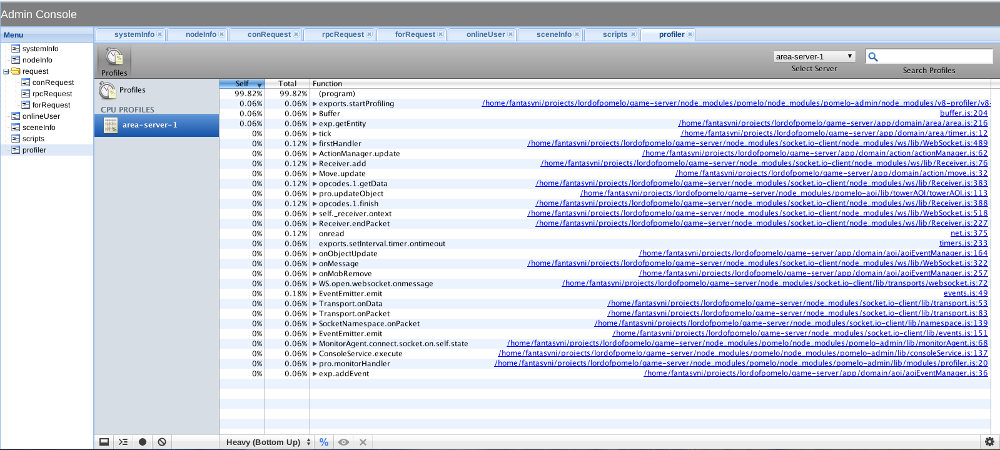

pomelo-admin-web 是 pomelo 框架中基于[pomelo-admin](https://github.com/NetEase/pomelo-admin)开发的web端监控的模块，可以通过 web 端的方式来对游戏服务器集群的运行状态，性能，日志等进行实时的监控，它采用‘类插件’的开发模式，开发者可以很方便的扩展具体的监控模块逻辑，目前在 adminConsole 中，集成的监控模块有如下几个： 



* systemInfo  
用于监控各个服务器上的系统信息，包括 loadavg,men,CPU(I/0),DISK(I/0)  

* nodeInfo  
用于监控各个服务器上的进程信息，包括 pid,cpu%,mem%，vsz，rss  

* conRequest  
用于监控由 connector 请求所产生的日志，包括玩家的登入，移动，切换场景等所花费的时间，并给出具体的路由(route)

* rpcRequest  
用于监控游戏服务器中 rpc 的调用情况，所花费的时间  

* forRequest  
用于监控由 forward 请求所产生的日志

* onlineUser  
用于实时监控在线玩家的信息，包括user login name，login ip，login time  

* sceneInfo  
用于实时监控玩家的场景信息，包括玩家所在的服务器，玩家所在的坐标等  

* scripts  
该模块提供了可以在 adminConsole 端在具体的服务器上执行脚本(script)  

* profiler  
该模块集成了chrome控制台下面的 Profiles 性能分析工具，可以用来对Pomelo服务器端的代码进行性能分析  

##adminConsole安装与使用  
运行环境：linux or mac os x   

    $ git clone https://github.com/NetEase/pomelo-admin-web.git
    $ cd pomelo-admin-web
    $ node app

浏览器中访问： http://localhost:7001， 就可以打开管理控制台界面。  
如果在此之前已经启动了 pomelo 项目，就可以在 adminConsole 上面进行监控了   
如果端口有冲突，请在config/admin.json修改端口，访问的浏览器必须支持websocket，推荐使用chrome.  

##scripts模块脚本编写注意事项  
scripts模块使用了 node.js 中的 [vm](http://nodejs.org/api/vm.html) module 来执行脚本  
内置提供了  
app --- pomelo application 实例    
os --- os 模块  
fs --- fs 模块  
process --- process 模块    
util --- util 模块    
来做为 vm 的 sandbox 上下文环境，即我们可以直接在脚本中调用这些  
为了便于输出结果，在 adminConsole 中，把执行的结果统一赋值给了全局 result 变量  
因此，在编写脚本的时候，要输出的结果要赋值给 result 变量（不要用 var 进行声明，它是全局的）  
比如，可以编写一个脚本来获取服务器的cpu数量信息  
```js
var cpus = os.cpus();
result = util.inspect(cpus,true,null);
```  
